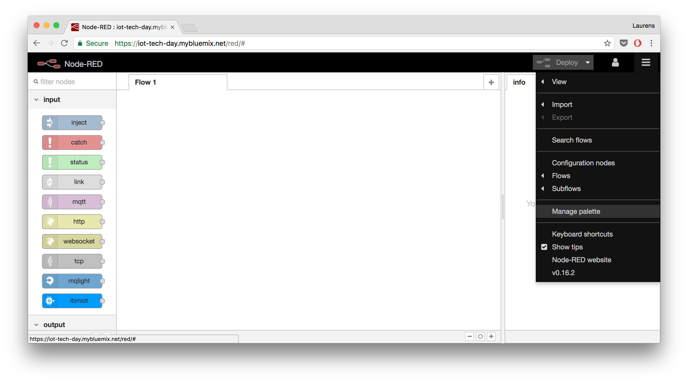
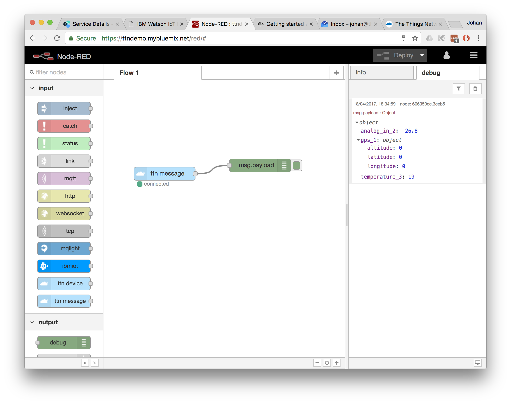

# Getting started with Watson IoT Platform using Node-RED

This tutorial describes how you can store and visualze the data you sent over The Things Network in IBM Watson IoT Platform. [This document](https://developer.ibm.com/recipes/tutorials/getting-started-with-watson-iot-platform-using-node-red/)
is used as a reference.

## Pre-requisites

* [IBM Bluemix account](http://console.ng.bluemix.net/?cm_mc_uid=95410921476214864587445&cm_mc_sid_50200000=1492548969&cm_mc_sid_52640000=1492548969)

## Setup your IBM account and Node-Red Starter
Check {IBMs documentation](https://developer.ibm.com/recipes/tutorials/getting-started-with-watson-iot-platform-using-node-red/) for doing so. 

### Add the TTN Node to Node Red
Go to **Palette Manager** by clicking on the top-right menu. Install: `node-red-contrib-ttn`

### Connect your SODAQ ONE device

Go to your IBM Watson IoT environment (not your Node-Red one)

* Add the **Service** `Internet of Things Platform` [(more info)](https://developer.ibm.com/recipes/tutorials/how-to-register-devices-in-ibm-iot-foundation/)

* Go to devices
* Create a new device and give it a nice name
* Use as the `Device ID` the one which you registered in the **Console**

*You can leave all the other parts empty*

#### Go back to your Node-Red environment 
* Add the `ttn message` node and fill in the details
* Connect the `debug` node to the `ttn message`
* Click the red button `Deploy` 

* 

* Create device
* Create device type
