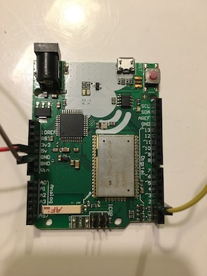
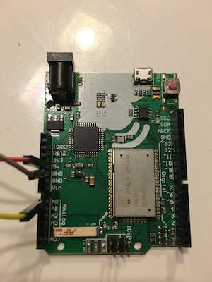
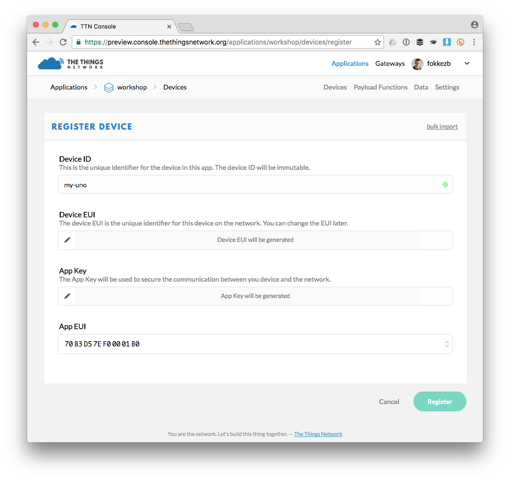
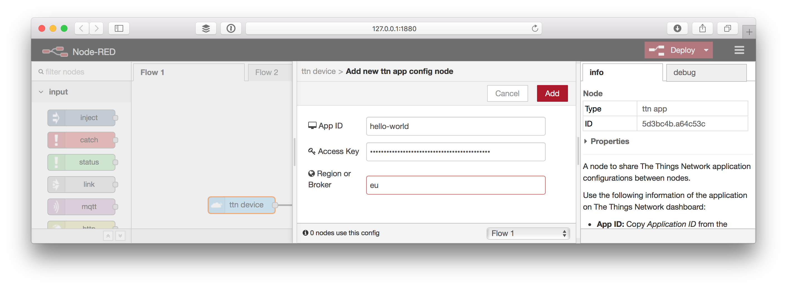
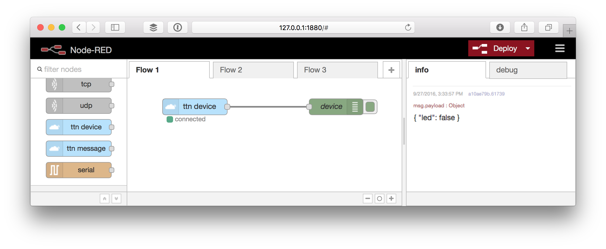
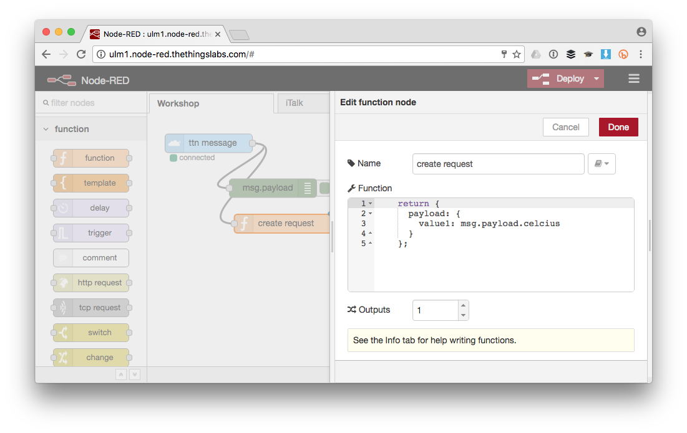
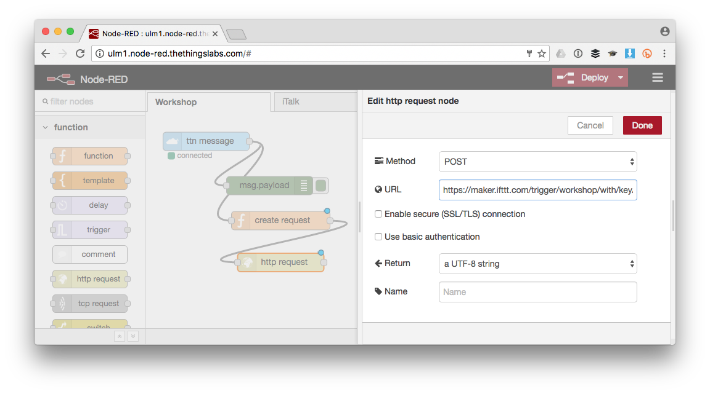

# The Things Uno Workshop


## Pre-requisites

1.  [The Things Uno](https://shop.thethingsnetwork.com/index.php/product/the-things-uno/)
2.  Micro-USB cable
3.  One or more sensors (hint: analog ones are more fun)
    1. Grove shield or [4 pin male jumper to Grove 4 pin conversion cable](https://www.seeedstudio.com/Grove-4-pin-Male-Jumper-to-Grove-4-pin-Conversion-Cable-(5-PCs-per-Pack)-p-1565.html) if it's a Grove sensor.
4. Laptop with Windows 7 or higher, Mac OS X or Linux
5. A Node-RED instance at `http://hu*.node-red.thethingslabs.com/`

## 1. Connect your Uno

1.  [Download](https://www.arduino.cc/en/Main/Software) and install the latest Arduino Software (IDE).
2.  [Download](https://github.com/TheThingsNetwork/arduino-device-lib/archive/master.zip) the master version of The Things Network library.
3.  Follow the guide on [Importing a .zip Library](https://www.arduino.cc/en/Guide/Libraries#toc4).
4.  Connect the The Things Uno to your computer using the Micro-USB cable.
5.  Select **Tools > Board > Arduino Leonardo**
6.  Select **Tools > Port** > the port that identifies as **Arduino Leonardo**:

    
    
    > For Windows, see [Getting Started with the Arduino Leonardo and Micro](https://www.arduino.cc/en/Guide/ArduinoLeonardoMicro#toc2) on installing drivers and finding the COM port to select.
    
7.  Select **File > Examples > TheThingsNetwork > [DeviceInfo](https://github.com/TheThingsNetwork/arduino-device-lib/blob/master/examples/DeviceInfo/DeviceInfo.ino)**
8.  Select **Sketch > Upload** `Ctrl/⌘ U` to upload the sketch.
 
    Wait for the status bar to say *Done uploading*.
 
9.  Select **Tools > Serial Monitor** `Ctrl/⌘ Shift M` to open the Serial Monitor.

    Soon, you should see something like this:

    ```
    Device Information
    
    EUI: 0004A30B001B7AD2
    Battery: 3223
    AppEUI: 70B3D57EF000001C
    DevEUI: 0004A30B001B7AD2
    Data Rate: 5
    RX Delay 1: 1000
    RX Delay 2: 2000
    
    Use the EUI to register the device for OTAA
    -------------------------------------------
    ```
    
🎉 Congrats, you've setup Arduino IDE with The Things Network library, connected your device and uploaded a sketch to it.
    
## 2. Connect a Sensor

1.  Grab one sensor.
    *   If both ends have a white Grove connector, you'll need a Grove shield:
        1.  With great care not to damage any pins, place the shield on the Uno.
        2.  Connect the sensor to the board:
            * If it's a binary (2 states: `HIGH` and `LOW`) sensor, connect to a digital port.
            * If it's an analog sensor, connect to an analog port.
    *  If it has independent pins or if you have a Grove to 4 male pin cable, you can:
        * Plug them in the Uno directly:
            1.  Connect the red voltage `VCC` pin to the Uno's `5V` pin.
            2.  Connect the black/brown ground `GND` to one of Uno's `GND` pin.
            3.  Connect the yellow signal `SIG` to the Uno:
                *   If it's a binary (2 states: `HIGH` and `LOW`) sensor, connect to one of the digital pins (left photo).
                *   If it's a analog sensor, connect to one of the analog (`Ax`) pins (right photo).
    
                     
                
        *   Or use a breadboard. Since the Uno only has one voltage pin you'll always need a breadboard if you want to connect multiple sensors without a Grove shield.
    
            

2.  Look up the example sketch for your sensor on the Seeed Studio [Wiki](http://wiki.seeedstudio.com/wiki/Category:Grove).
3.  Upload the example to your Uno and use Serial Monitor to read it's value.

## Register with The Things Network
Your applications and devices can be managed by [The Things Network Dashboard][dashboard].

> You'll get a sneak preview of our new production environment! Just be aware that anything can and probably will change and you might lose data!

### Create an Account

To use the dashboard, you need an account.

1.  [Create an account][create-account].

    > You can change all fields including e-mail address and username later via your [Profile][profile].

2.  Check your mailbox to validate your e-mail address.
3.  Go to the [dashboard][dashboard] and log in.
4.  From the top right menu, select [Settings][settings] and change the default (handler) region if the one currently selected is not near where you'll be deploying your devices.

### Add an Application

Add your first The Things Network Application.

1.  On the [dashboard][dashboard], click [add application][add-application].

	* For **Application ID**, choose a unique ID of lower case, alphanumeric characters and nonconsecutive `-` and `_` (e.g. `hello-world`).
	* For **Application Description**, enter anything you like (e.g. `Hello, World!`).

	

2.  Click **Add Application** to finish.

    You will be redirected to the newly added application, where you can find the generated **Application EUI** and **Access Key** which we'll need later.

> **Note:** Every component on the dashboard has a small help icon. Click it to get more information on how to use that component.

### Register a Device

The Things Network supports the two LoRaWAN mechanisms to register devices: Over The Air Activation (OTAA) and Activation By Personalization (ABP). In this workshop, we will use ABP.

> In production, you'll want to use OTAA, which is the default. This is more reliable because the activation will be confirmed and more secure because the session keys will be negotiated with every activation. ABP is useful for workshops because you don't have to wait for a downlink window to become available to confirm the activation.

1.  On the application screen, select **Devices** from the top right menu.
2.  In the **Devices** box, click **register device**.

    * For **Device ID**, choose a - for this application - unique ID of lower case, alphanumeric characters and nonconsecutive `-` and `_` (e.g. `my-uno`).
    * For **Device EUI**, click the **randomize** link.

    

3.  Click **Register**.

    You will be redirected to the newly registered device.
    
4.  On the device screen, select **Settings** from the top right menu.
5.  In the **Device Settings** box, click **personalize device**.
6.  Click **Personalize**.
7.  Go back to **Settings** again.
8.  Check **Disable frame counter checks**.

    > **Note:** This allows you to restart your device for development purposes without the routing services keeping track of the frame counter. This does make your application vulnerable for replay attacks, e.g. sending messages with a frame counter equal or lower than the latest received. Please do not disable it in production.

9.  Click **Save** to finish.

    You will be redirected to the device, where you can find the **Device Address** and **Session Keys** we'll need next.
    
    

## Send a Message

1.  In the Arduino IDE, select **File > Examples > TheThingsNetwork > [Workshop](https://github.com/TheThingsNetwork/arduino-device-lib/blob/master/examples/Workshop/Workshop.ino)**.
2.  Set the values for `devAddr`, `nwkSKey`, `appSKey` using the information from the previous step.
   
    * For `devAddr ` use the **Device Address** found on the device's page on the dashboard. Click `<>` to toggle to the **msb** format and then `📋` to copy.
    * For `nwkSKey ` use the **Network Session Key**. Click `<>` to toggle to the **msb** format. You'll have to click `👁` to show the key before you can copy it.
    * For `appSKey` use **App Session Key**.
    * Replace `/* TTN_FP_EU868 or TTN_FP_US915 */` with `TTN_FP_EU868` since that's the frequency plan we're on.

3.  Select **Sketch > Upload** `Ctrl/⌘ U` to upload the sketch.
 
    Wait for the status bar to say *Done uploading*.
 
4.  Select **Tools > Serial Monitor** `Ctrl/⌘ Shift M` to open the Serial Monitor.

    Soon, you should see something like this:

    ```
    Sending: mac tx uncnf 1 with 3 bytes
    Successful transmission
    ```

## Send your Data

Now try to send your sensor data by mixing the sketch example you found for your sensor and the workshop sketch you just uploaded. See [Working with bytes guide](https://www.thethingsnetwork.org/docs/refactor/uno/#working-with-bytes) for help with encoding values to bytes.

## Decode your Data

To make working with payloads easier, The Things Network allows you to
decode bytes to a meaningful data structure for your application.

> We will only use the **decoder** in this workshop. This is basically the reverse of you encoded the data in the sketch. You can also use a **converter** to combine values or convert units and a **validator** to drop invalid payloads.

1.  From the application on the dashboard, select **Payload Functions** from the top right menu.
2.  Use the **decoder** template and the [Working with bytes guide](https://www.thethingsnetwork.org/docs/refactor/uno/#working-with-bytes) to decode your sensor data from bytes to an object.
3.  Use the input field and **Test** button to see how various payloads will be decoded.
4.  When you are happy with the output of your payload function, click **Save**.
5.  Select **Data** from the top right menu to see how payloads will now be decoded:

    

## Process your Data

We will use [Node-RED](http://nodered.org) to get the data from The Things Network routing services and push it to an application back-end.

> Node-RED allows you to build all kinds of flows with basic business logic. You can add switches, triggers, custom functions and install thousands of nodes with additional functionality, for example storing data in a database.

1.  Ask your workshop facilitator for the URL to your own Node-RED environment.
2.  From the **input** category in the toolbox on the left, drag a new **ttn** node to your flow.
3.  Double-click the node.
4.  Click the `✏️` to *Add new ttn app...*.

    Copy-paste the following information from the dashboard:
    
    * For **App ID**, copy **Application ID** from the **Application Overview** box.
    * For **Access Key**, scroll down to the **Access Keys**. For the key you'd like to use, click `👁` to show the key and then `📋` to copy it.
    * For **Region or Broker**, scroll back again to use **Handler Status** from the **Application Overview** box. Only copy the last bit following `ttn-handler-`.

    
    
5.  Click **Add**.
6.  Click **Done**.
7.  From the **output** category, drag a new **debug** node to the flow and drag the top out of the **ttn** node to the input of the **debug** node to connect them.
8.  Click **Deploy** and monitor the **debug** tab on the right for incoming messages.

    

## Push to IFTTT

A common use case is to invoke a HTTP request to an external web service of your application. To complete the end-to-end workshop, we're going to use If This Then That (IFTTT) to connect to APIs.

### Create the IFTTT Recipe
Let's start on IFTTT.

1.  Go to [IFTTT](https://ifttt.com) and create an account or login.
2.  Go to [Create a Recipe](https://ifttt.com/myrecipes/personal/new).
3.  Click **this** to Choose Trigger Channel.

    1.  Search for `maker`.
    2.  Click the **Maker** channel.

    The first time you'll need to click **Connect**, then **Done** in the popup that opens and finally **Continue to the next step**.
    
4.  Click **Receive a web request**.

    *  For **Event Name**, let's enter `workshop`.
    
5.  Click **That** to configure an action, e.g. post a tweet on Twitter, e-mail or a notification to your phone.

    Use the fields `value1` and `value2` as ingredient. For example, a tweet could be:
    
    ```
    Hey, the temperature is {{value2}} degrees! #thethingsntwrk
    ```

7.  Click **Create Action**.
8.  Click **Create Recipe**.
9.  Go to the [Maker Channel](https://ifttt.com/maker) to find your key.

### Update the Node-RED flow

1.  In Node-RED, drop a new **function** on the flow from the **function** category of the toolbox.
2.  Drag a wire from the upper output of the **ttn** node to the input of the new node.
3.  Double click the new node to edit it.
4.  Enter a **Name** like `create request`.
5.  As the actual **Function** IFTTT expects a payload with `value[1-3]`.

    For example, we could pass a temperature's sensor's field as:

    ```javascript
    return {
        payload: {
            value2: msg.payload.celcius
        }
    };
    ```

    This should look something like:

    

6.  Drag a **http request** node from the same **function** category.
7.  Drag a wire from the output of the **create request** node to the input of the **http request** node.
8.  Double click the new node to edit it.
9.  As **Method** select **POST**.
10. For **URL** enter `https://maker.ifttt.com/trigger/{event}/with/key/{key}`.

    * Replace `{event}` with the **Event Name** `workshop` we used at IFTTT.
    * Replace `{key}` with the key you found at the [Maker Channel](https://ifttt.com/maker).

    
    
11. Click **Done** and you should now have something like:

    

12. Click **Deploy** and you should see the e-mail or tweet come in soon!
    
13. Go to [My Recipes](https://ifttt.com/myrecipes/personal) to turn off the recipe, unless you like to be spammed. 😱

## OK. Done. What's Next?

🎉 Congratulations! You just learned how to create an account, an application, register a device, send data from a device, decode it, get it in Node-RED, process it and push it to IFTTT to connect to the world of APIs.

Node-RED can be used to build complex applications too. You can store data in a database, query data on an interval, add all kinds of business rules and invoke any web service.

From this starting point, you can start building a real world application. Here are some useful links:

- [Set up Node-RED and install the TTN node locally.](https://www.thethingsnetwork.org/docs/node-red/#setup)
- Use Node-RED to store data in a time series database, for example [InfluxDB](https://influxdata.com) via the [InfluxDB node](http://flows.nodered.org/node/node-red-contrib-influxdb).
- [Install additional nodes for Node-RED.](http://flows.nodered.org)
- [Receive and process data on any platform using MQTT.](https://www.thethingsnetwork.org/docs/mqtt/)
- Visualize your data, for example with [Grafana](http://grafana.org) which works good with InfluxDB.
- Create your own charts and maps, e.g. combine our [Socket.io example](https://github.com/TheThingsNetwork/node-app-lib/tree/master/examples/socketio) with [Flot](http://flotcharts.org) or [Google Maps API](https://developers.google.com/maps/).
- [Send messages back to the device.](https://www.thethingsnetwork.org/docs/mqtt/#send-messages-down)
- Integrate with IoT cloud platforms like [Azure IoT Hub](https://github.com/theThingsNetwork/azure-app-lib) and [AWS IoT](https://github.com/theThingsNetwork/aws-app-lib).

[account]:         https://staging.account.thethingsnetwork.org/
[create-account]:  https://staging.account.thethingsnetwork.org/register
[profile]:         https://staging.account.thethingsnetwork.org/users/profile
[dashboard]:       https://preview.dashboard.thethingsnetwork.org/
[settings]:        https://preview.dashboard.thethingsnetwork.org/settings
[add-application]: https://preview.dashboard.thethingsnetwork.org/applications/add
