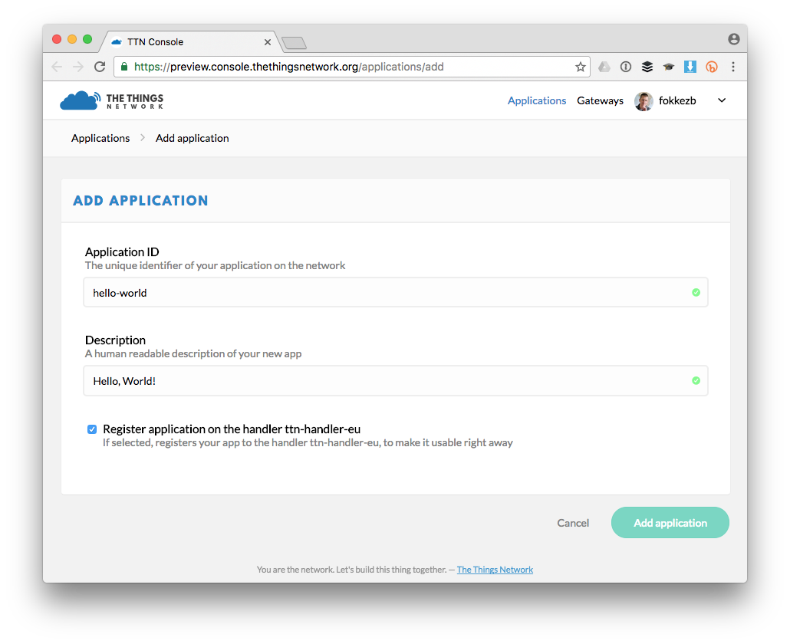
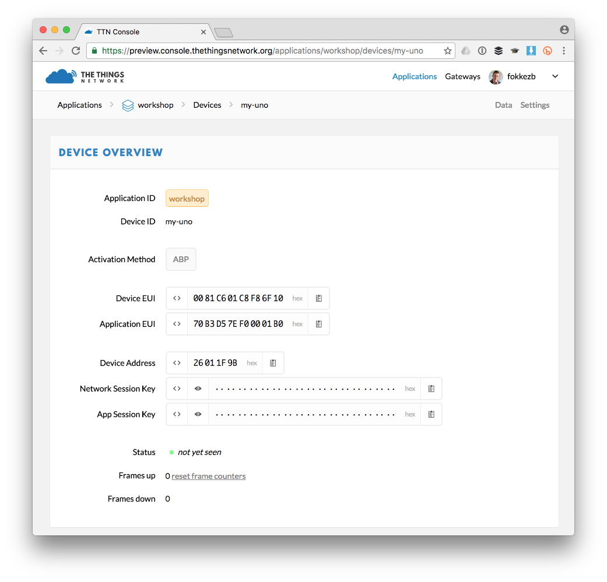
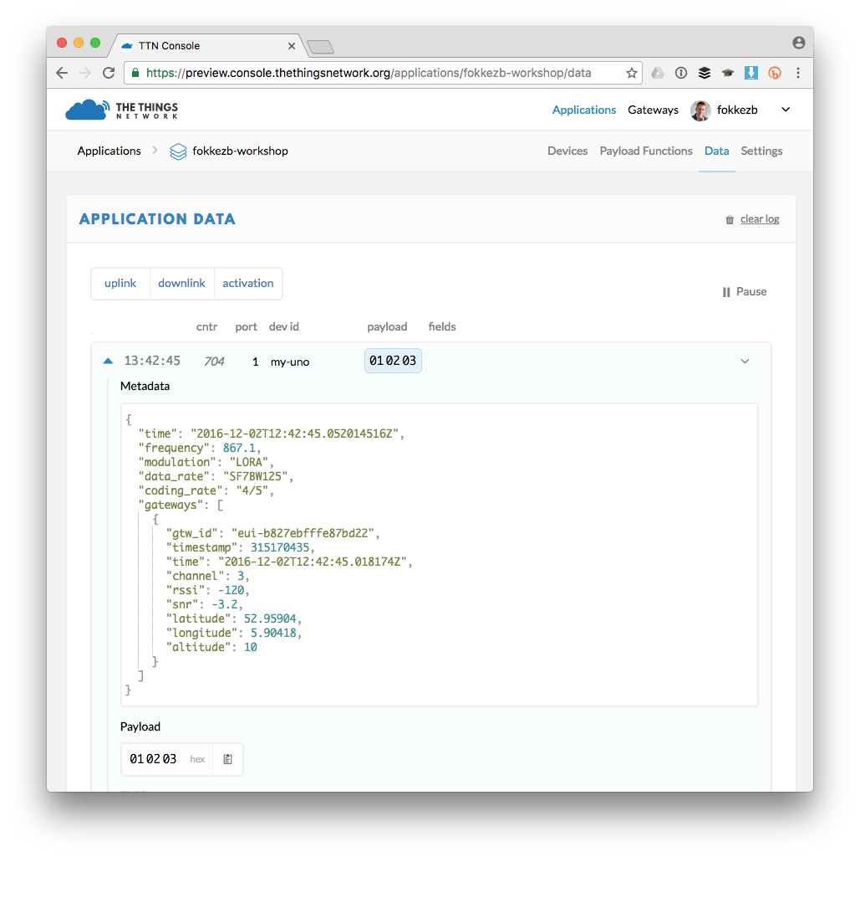
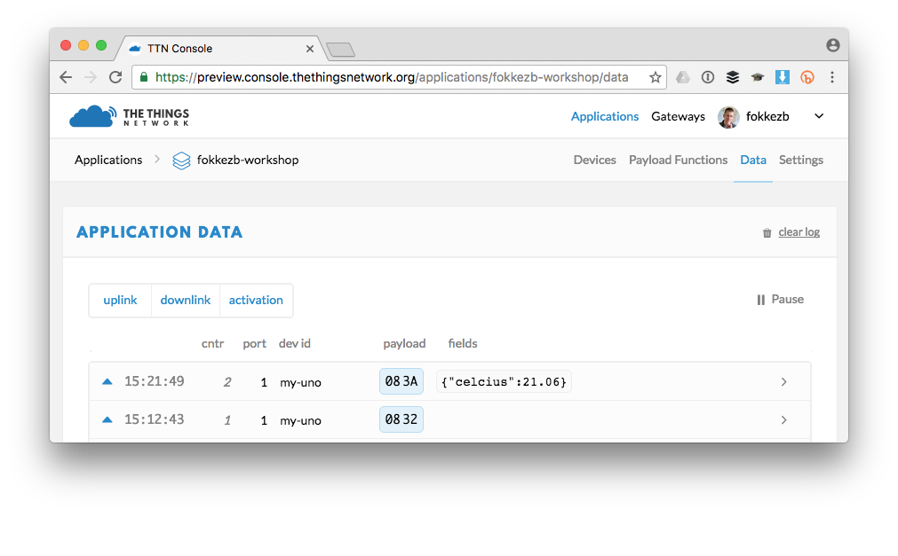
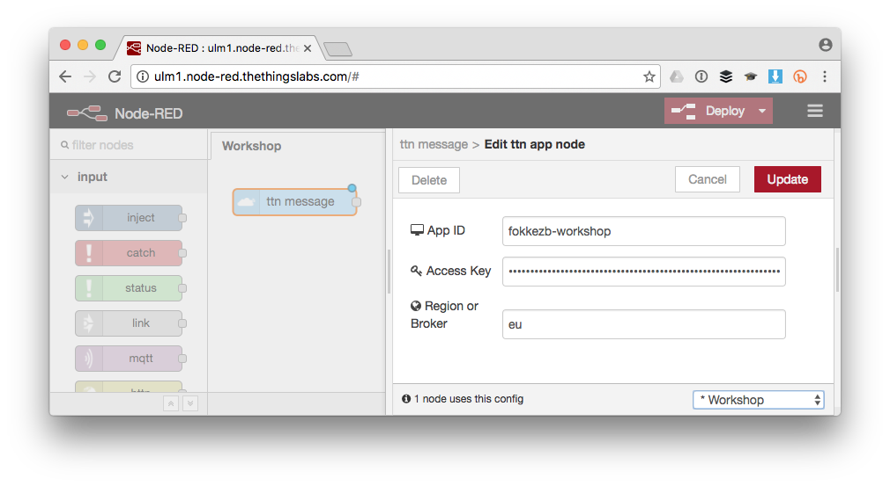
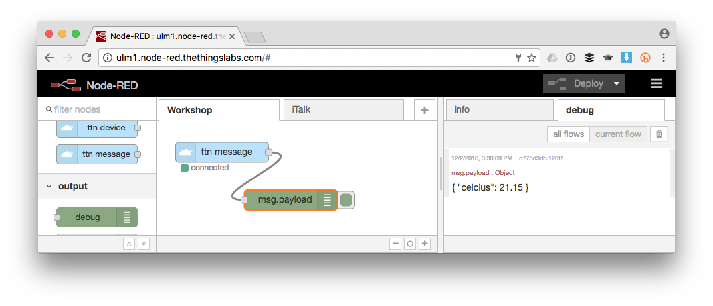

# The Things Uno Workshop

## Pre-requisites

1. The Things Uno
2. Micro-USB cable
3. Light and temperature sensor
4. Breadboard
5. Laptop with Windows 7 or higher, Mac OS X or Linux

## Setup

### Arduino IDE

Set up the IDE and connect your Uno.

1.  [Download](https://www.arduino.cc/en/Main/Software) and install the latest Arduino Software (IDE).
2.  Navigate to **Sketch > Include Library > Manage Libraries...**.
3.  Search for **TheThingsNetwork** and click the result to select it.
4.  Click the **Install** button which should appear:

    

5.  Connect the The Things Uno to your computer using the Micro-USB cable.
6.  Select **Tools > Board > Arduino Leonardo**
7.  Select **Tools > Port** > the port that identifies as **Arduino Leonardo**:

    
    
    > For Windows, see [Getting Started with the Arduino Leonardo and Micro](https://www.arduino.cc/en/Guide/ArduinoLeonardoMicro#toc2) on installing drivers and finding the COM port to select.

### The Things Network Dashboard

Your applications and devices can be managed by [The Things Network Dashboard][dashboard].

#### Create an Account

To use the dashboard, you need an account.

1.  [Create an account][create-account].

    > You can change all fields including e-mail address and username later via your [Profile][profile].

2.  Check your mailbox to validate your e-mail address.
3.  Go to the [dashboard][dashboard] and log in.
4.  From the top right menu, select [Settings][settings] and change the default (handler) region if the one currently selected is not near where you'll be deploying your devices.

#### Add an Application

Add your first The Things Network Application.

1.  On the [dashboard][dashboard], click [add application][add-application].

	* For **Application ID**, choose a unique ID of lower case, alphanumeric characters and nonconsecutive `-` and `_` (e.g. `hello-world`).
	* For **Application Description**, enter anything you like (e.g. `Hello, World!`).

	

2.  Click **Add Application** to finish.

    You will be redirected to the newly added application, where you can find the generated **Application EUI** and **Access Key** which we'll need later.

> **Note:** Every component on the dashboard has a small help icon. Click it to get more information on how to use that component.

#### Register a Device

The Things Network supports the two LoRaWAN mechanisms to register devices: Over The Air Activation (OTAA) and Activation By Personalization (ABP). In this workshop, we will use ABP.

> In production, you'll want to use OTAA, which is the default. This is more reliable because the activation will be confirmed and more secure because the session keys will be negotiated with every activation. ABP is useful for workshops because you don't have to wait for a downlink window to become available to confirm the activation.

1.  On the application screen, select **Devices** from the top right menu.
2.  In the **Devices** box, click **register device**.

    * For **Device ID**, choose a - for this application - unique ID of lower case, alphanumeric characters and nonconsecutive `-` and `_` (e.g. `my-uno`).
    * For **Device EUI**, click the **randomize** link.

    

3.  Click **Register**.

    You will be redirected to the newly registered device.
    
4.  On the device screen, select **Settings** from the top right menu.
5.  In the **Device Settings** box, click **personalize device**.
6.  Click **Personalize**.
7.  Go back to **Settings** again.
8.  Check **Disable frame counter checks**.

    > **Note:** This allows you to restart your device for development purposes without the routing services keeping track of the frame counter. This does make your application vulnerable for replay attacks, e.g. sending messages with a frame counter equal or lower than the latest received. Please do not disable it in production.

9.  Click **Save** to finish.

    You will be redirected to the device, where you can find the **Device Address** and **Session Keys** we'll need next.
    
    

## Send a Message

### Configure

1.  In the Arduino IDE, select **File > Examples > TheThingsNetwork > [Workshop](https://github.com/TheThingsNetwork/arduino-device-lib/blob/master/examples/Workshop/Workshop.ino)**.
2.  Set the values for `devAddr`, `nwkSKey`, `appSKey` using the information from the previous step.
   
    * For `devAddr ` use the **Device Address** found on the device's page on the dashboard. Click `<>` to toggle to the **msb** format and then `📋` to copy.
    * For `nwkSKey ` use the **Network Session Key**. Click `<>` to toggle to the **msb** format. You'll have to click `👁` to show the key before you can copy it.
    * For `appSKey` use **App Session Key**.

### Upload

1.  Select **Sketch > Upload** `Ctrl/⌘ U` to upload the sketch.
 
    Wait for the status bar to say *Done uploading*.
 
2.  Select **Tools > Serial Monitor** `Ctrl/⌘ Shift M` to open the Serial Monitor.

    Soon, you should see something like this:

    ```
    Sending: mac tx uncnf 1 with 3 bytes
    Successful transmission
    ```

### Receive

From the application on the dashboard, select **Data** in the top right menu. You should now see the messages come in:



You are sending these three bytes in the [`loop()`](https://www.arduino.cc/en/Reference/Loop) function of your sketch, which currently looks like this:

```c
void loop() {
  // Create a buffer with three bytes  
  byte payload[3] = { 0x01, 0x02, 0x03 };

  // Send it to the network
  ttn.sendBytes(payload, sizeof(payload));

  // Wait 10 seconds
  delay(10000);
}
```

## Sending Sensor Values

Instead of sending three bytes, we're going to send real sensor values. But first, we need to connect our sensors. In this workshop, we will use a light and a temperature sensor.

### Connect the Sensors

Both the light and the temperature sensor have three pins to connect: voltage `VCC`, signal `SIG` and ground `GND` (the pin `NC` is not connected). We will connect these pins to the 5 Volts output `5V`, analog pins `A0` and `A1` for signal, and ground `GND` of The Things Uno.

Use the following photos as reference:


### Read the Sensors

Now that the sensors are connected, we have to write some code in the sketch to read their values.

1.  Replace your `loop()` function with the following code:

    ```c
    uint16_t getLight(int pin) {
      return analogRead(pin);
    }
    
    float getCelcius(int pin) {
      // See http://www.seeedstudio.com/wiki/Grove_-_Temperature_Sensor
      int a = analogRead(pin);
      float resistance = (1023.0 - a) * 10000 / a;
      return 1 / (log(resistance/10000)/3975 + 1 / 298.15) - 273.15;
    }
    
    void loop() {
      // Read the sensors.
      uint16_t light = getLight(A0);
      float celcius = getCelcius(A1);
    
      // Show the values in the serial monitor for debugging
      debugSerial.println("Light is " + String(light));
      debugSerial.println("Temperature is " + String(celcius));
    
      // To get rid of floating point and keep two decimals,
      // multiply by 100 (e.g. 21.52 becomes 2152)
      int16_t temperature = (int16_t)(celcius * 100);
    
      // We need 4 bytes to send both values
      byte payload[4];
      payload[0] = light >> 8;
      payload[1] = light & 0xFF;
      payload[2] = temperature >> 8;
      payload[3] = temperature & 0xFF;
      
      // Send it to the network
      ttu.sendBytes(payload, sizeof(payload));
    
      debugSerial.println();
    
      // Wait 10 seconds
      delay(10000);
    }
    ```

2.  Select **Sketch > Upload** `Ctrl/⌘ U`.
3.  Select **Tools > Serial Monitor** `Ctrl/⌘ Shift M`.

    You should see something like:
    
    ```
    Light is 782
    Temperature is 19.82
    Sending: mac tx uncnf 1 with 4 bytes
    Successful transmission
    ```

4.  From the device on the dashboard, select **Data** form the top right menu.

    You should see payloads of four bytes, e.g. `03 0B 07 BE`.

#### Decode the Payload

To make working with payloads easier, The Things Network allows you to
decode bytes to a meaningful data structure for your application.

> We will only use the **decoder** in this workshop. You can also use a **converter** to combine values or convert units and a **validator** to drop invalid payloads.

1.  From the application on the dashboard, select **Payload Functions** from the top right menu.
2.  Leave **decoder** selected and copy-paste the following JavaScript code:

    ```js
    function Decoder(bytes) {
      // Decode an uplink message from a buffer
      // (array) of bytes to an object of fields.
      var decoded = {};
    
      decoded.light = (bytes[0] << 8) | bytes[1];
      
      var temperature = (bytes[2] << 8) | bytes[3];
      decoded.celcius = temperature / 100;
    
      return decoded;
    }
    ```
    
    This is basically the reverse of you encoded the data in the sketch.

3.  Use the input field and **Test** button to see how various payloads will be decoded.

    For example, enter `03 0B 07 BE` and click **Test** to see:

    ```json
    {
      "celcius": 19.82,
      "light": 779
    }
    ```

4.  When you are happy with the output of your payload function, click **Save**.
5.  Select **Data** from the top right menu to see how payloads will now be decoded:

    

## Getting Your Data

We will use [Node-RED](http://nodered.org) to get the data from The Things Network routing services and push it to an application back-end.

> Node-RED allows you to build all kinds of flows with basic business logic. You can add switches, triggers, custom functions and install thousands of nodes with additional functionality, for example storing data in a database.

1.  Ask your workshop facilitator for the URL to your own Node-RED environment.
2.  From the **input** category in the toolbox on the left, drag a new **ttn** node to your flow.
3.  Double-click the node.
4.  Click the `✏️` to *Add new ttn app...*.

    Copy-paste the following information from the dashboard:
    
    * For **App ID**, copy **Application ID** from the **Application Overview** box.
    * For **Access Key**, scroll down to the **Access Keys**. For the key you'd like to use, click `👁` to show the key and then `📋` to copy it.
    * For **Region or Broker**, scroll back again to use **Handler Status** from the **Application Overview** box. Only copy the last bit following `ttn-handler-`.

    
    
5.  Click **Add**.
6.  Click **Done**.
7.  From the **output** category, drag a new **debug** node to the flow and drag the top out of the **ttn** node to the input of the **debug** node to connect them.
8.  Click **Deploy** and monitor the **debug** tab on the right for incoming messages.

    You should see messages like:

    ```json
    {
    	"port": 1,
    	"counter": 48,
    	"payload_raw": {
    		"type": "Buffer",
    		"data": [3, 11, 7, 190]
    	},
    	"payload_fields": {
    		"celcius": 19.82,
    		"light": 779
    	},
    	"metadata": {
    		"time": "2016-09-27T11:56:07.36400014Z",
    		"frequency": 868.1,
    		"modulation": "LORA",
    		"data_rate": "SF7BW125",
    		"coding_rate": "4/5",
    		"gateways": [{
    			"gtw_id": "eui-b827ebfffe87bd22",
    			"timestamp": 3245050619,
    			"time": "2016-09-27T11:56:07.335979Z",
    			"rssi": -103,
    			"snr": 7,
    			"rf_chain": 1
    		}]
    	}
    }
    ```



## Push to IFTTT

A common use case is to invoke a HTTP request to an external web service of your application. To complete the end-to-end workshop, we're going to use If This Then That (IFTTT) to connect to APIs.

### Create the IFTTT Recipe
Let's start on IFTTT.

1.  Go to [IFTTT](https://ifttt.com) and create an account or login.
2.  Go to [Create a Recipe](https://ifttt.com/myrecipes/personal/new).
3.  Click **this** to Choose Trigger Channel.

    1.  Search for `maker`.
    2.  Click the **Maker** channel.

    The first time you'll need to click **Connect**, then **Done** in the popup that opens and finally **Continue to the next step**.
    
4.  Click **Receive a web request**.

    *  For **Event Name**, let's enter `workshop`.
    
5.  Click **That** to configure an action, e.g. post a tweet on Twitter, e-mail or a notification to your phone.

    Use the fields `value1` and `value2` as ingredient. For example, a tweet could be:
    
    ```
    Hey, the light is {{value1}} and the temperature is {{value2}} degrees! #thethingsntwrk
    ```

7.  Click **Create Action**.
8.  Click **Create Recipe**.
9.  Go to the [Maker Channel](https://ifttt.com/maker) to find your key.

### Update the Node-RED flow

1.  In Node-RED, drop a new **function** on the flow from the **function** category of the toolbox.
2.  Drag a wire from the upper output of the **ttn** node to the input of the new node.
3.  Double click the new node to edit it.
4.  Enter a **Name** like `create request`.
5.  As the actual **Function** IFTTT expects a payload with `value[1-3]`.

    Building on [The Things Uno / Quick Start](/uno/#quick-start) use: 

    ```javascript
    return {
        payload: {
            value1: msg.payload.light,
            value2: msg.payload.celcius
        }
    };
    ```

    This should look something like:

    

6.  Drag a **http request** node from the same **function** category.
7.  Drag a wire from the output of the **create request** node to the input of the **http request** node.
8.  Double click the new node to edit it.
9.  As **Method** select **POST**.
10. For **URL** enter `https://maker.ifttt.com/trigger/{event}/with/key/{key}`.

    * Replace `{event}` with the **Event Name** `workshop` we used at IFTTT.
    * Replace `{key}` with the key you found at the [Maker Channel](https://ifttt.com/maker).

    
    
11. Click **Done** and you should now have something like:

    

12. Click **Deploy** and you should see the e-mail or tweet come in soon!
    
13. Go to [My Recipes](https://ifttt.com/myrecipes/personal) to turn off the recipe, unless you like to be spammed. 😱

## OK. Done. What's Next?

🎉 Congratulations! You just learned how to create an account, an application, register a device, send data from a device, decode it, get it in Node-RED, process it and push it to IFTTT to connect to the world of APIs.

Node-RED can be used to build complex applications too. You can store data in a database, query data on an interval, add all kinds of business rules and invoke any web service.

From this starting point, you can start building a real world application. Here are some useful links:

- [Set up Node-RED and install the TTN node locally.](https://www.thethingsnetwork.org/docs/node-red/#setup)
- Use Node-RED to store data in a time series database, for example [InfluxDB](https://influxdata.com) via the [InfluxDB node](http://flows.nodered.org/node/node-red-contrib-influxdb).
- [Install additional nodes for Node-RED.](http://flows.nodered.org)
- [Receive and process data on any platform using MQTT.](https://www.thethingsnetwork.org/docs/mqtt/)
- Visualize your data, for example with [Grafana](http://grafana.org) which works good with InfluxDB.
- Create your own charts and maps, e.g. combine our [Socket.io example](https://github.com/TheThingsNetwork/node-app-lib/tree/master/examples/socketio) with [Flot](http://flotcharts.org) or [Google Maps API](https://developers.google.com/maps/).
- [Send messages back to the device.](https://www.thethingsnetwork.org/docs/mqtt/#send-messages-down)
- Integrate with IoT cloud platforms like [Azure IoT Hub](https://github.com/theThingsNetwork/azure-app-lib) and [AWS IoT](https://github.com/theThingsNetwork/aws-app-lib).

[account]:         https://staging.account.thethingsnetwork.org
[create-account]:  https://staging.account.thethingsnetwork.org/register
[profile]:         https://staging.account.thethingsnetwork.org/users/profile
[dashboard]:       https://staging.thethingsnetwork.org
[settings]:        https://preview.dashboard.thethingsnetwork.org/settings
[add-application]: https://preview.dashboard.thethingsnetwork.org/applications/add
