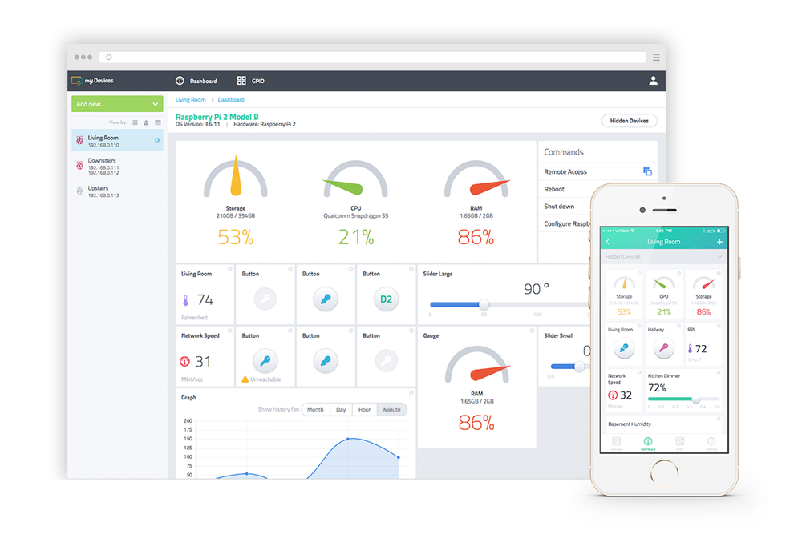

# myDevices Cayenne integration

myDevices Cayenne allows you to quickly design, prototype, and visualize IoT solutions. You can use Cayenne to build a nice-looking dashboard that showcases your data nicely.




## Setup your myDevices account

1.  Create an account on [myDevices](https://mydevices.com/)
2.  Log-in and click on **LoRa**
	
	
3.  Select **The Things Network** at the bottom of the left menu bar, click on **Cayenne LPP** and fill in your **DevEUI** of your device (which you can find in the [**Console**](https://console.thethingsnetwork.org/applications))
	


## Add the myDevices Cayenne integration in the Console

1.  Go to your application in the [**Console**](https://console.thethingsnetwork.org/applications) and add the myDevices integration via **Add Integration**
	 

2.  You can find your **Process ID** in the URL of the myDevices dashboard, starting after `/lora/`
3.  Add the integration


## Change the payload format 

In order to display your content in the Cayenne dashboard, we need to change the format of the payload in the Arduino Sketch.

> We need to send extra data for Cayenne to understand what data comes into their dashboard. Before we send the sensor data, we need to define what data is sent. The first byte is the so-called **Channel ID**. The sencond bytes explains the **Data Type** (so Cayenne knows that the data contains temperature values). The latter bytes contain the actualy sensor values.
 Please have a look [here](https://www.thethingsnetwork.org/docs/devices/arduino/api/cayennelpp.html) to find more information on the Cayenne Lower Power Protocol (LPP).
 
 
*  Add the following code at the very beginning of the Arduino sketch:

```
#include <CayenneLPP.h>
```
* Add the following code right before `void setup()` which sets the maximum payload size to 51 bytes.

```
CayenneLPP lpp(51);
```

* The payload we need to send is a bit different than before. You can replace the `void loop(){ }` with the code below and upload the sketch to The Things Uno.

```
float celcius(int pin) {
  int a = analogRead(A2);
  float resistance = (1023.0 - a) * 10000 / a;
  return 1 / (log(resistance/10000)/3975 + 1 / 298.15) - 273.15;
}

void loop() {
  debugSerial.println("-- LOOP");

  float celcius = getCelcius(A2);

  lpp.reset();
  lpp.addTemperature(1, celcius);

  ttn.sendBytes(lpp.getBuffer(), lpp.getSize());

  delay(10000);
}
```

## Build your Cayenne dashboard
Click the device on the left side of your dashboard in Cayenne and you data is should be shown right away. After a bit of editing you can make it look something like this:

 


🎉 Great job! Now impress some folks with this amazing dashboard you built on Twitter. *Don't forget to add The Things Network in your Tweet: @thethingsntwrk*
